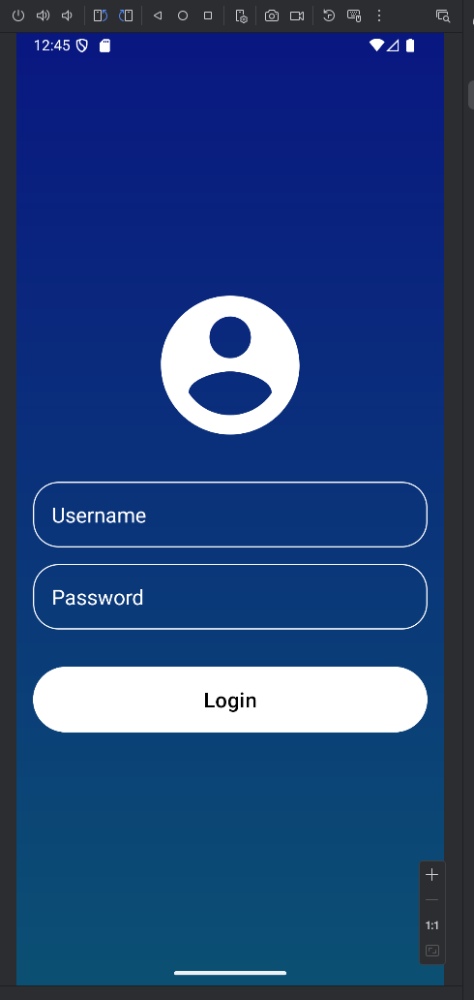

# Simple Login UI (Non-Functional)

This is a basic Android login UI prototype. It currently has no functionality and serves only as a visual layout.

## Features

- Gradient background
- Centered user icon
- Username and Password input fields
- Rounded Login button

> ⚠️ This is a static UI only. It does not include any input handling, validation, or authentication logic.

## Screenshot

## Technologies

- Android Studio
- Kotlin XML Layout

---

Feel free to use this as a starter layout for your Android app.
